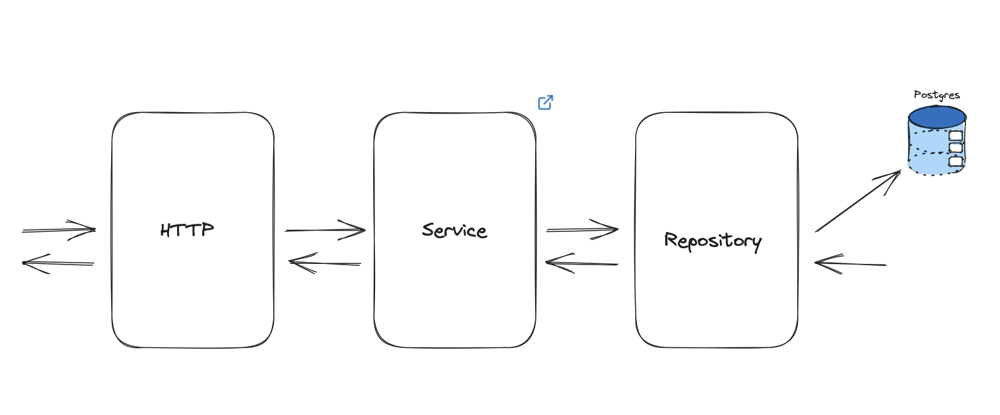

# Simple Go REST-API

### Index
- [Tools Overview](##Tools-Overview)
- [Architectural Decisions](##Architectural-Decisions)
- [Design Decisions](##-Design-Decisions)
    - [Context Propagation](###Context-Propagation)

## Tools Overview

- Task

## Architectural Overview

## Design Decisions
 - [**Context Propogation**](###Context-Propagation)

### Context Propagation

When it comes to propagating information between different layers of a Service, the context becomes invaluable

A request may contain some form of observability information associated with the request. 

As a request hits the HTTP handler function, we would like to extract such observability information from that incoming request and propagate it through various layers of the application.

In the event of a logging condition, we are able to log with the context containing observability information associated with the request (trace and request ID)

When it comes to debugging what’s wrong with the application, trace, and request ID becomes important to observability, especially as the number of services and service interactions increases.